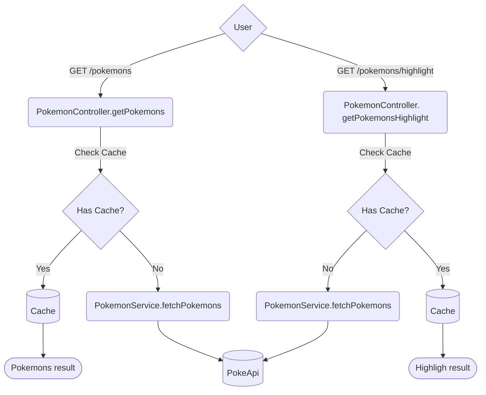

# LooqBox Backend Challenge

In this project, a microservice was developed to consume the PokeAPI and return the desired results.


## Tech Stack

- **Linguagem:** Kotlin
- **Framework:** Spring Boot.
- **Gerenciador de Dependências:** Gradle.
- **Teste:** JUnit.
- **Containerização:** Docker.

## Endpoints

| Método | Endpoint               | Parâmetros       | Descrição                                                         |
|--------|-------------------------|------------------|-------------------------------------------------------------------|
| `GET`  | `/pokemons`             | `query`(optional), `sort`(optional)| search for a Pokémon by name based on the parameters provided                        |
| `GET`  | `/pokemons/highlights`         | `query`(optional), `sort`(optional) | return objects "highlight"  based on parameters provided          |


## Run Locally
### **IDE** 

**Required: Kotlin 1.6+**

Clone the project
```bash
git clone https://github.com/Harlocchi/looqbox-challenge.git
```

Go to the project directory
```bash
cd looqbox-challenge
```

run the project
```bash
gradle bootRun

```

### **Docker**

**Required: Docker**

Clone the project
```bash
git clone https://github.com/Harlocchi/looqbox-challenge.git
```
Go to the project directory
```bash
cd looqbox-challenge
```
generate the .Jar file on root
```bash
./gradlew build
```
generate the image
```bash
docker build -t looqBox-challenge .
```

run the container
```bash
docker run -d -p 8080:8080 looqBox-challenge
```


## Api Diagram

## Sort Algorithm

initially, the sorting algorithm chosen was **Insertion-sort**, as it was simple and easy to understand, where it completed processing in **≈11ms** and had a performance of **O(n2)**, with exactly 1302 records (its quality is that we do not need to allocate another auxiliary list, we apply comparisons and changes to the main list)

but, I decided to sacrifice ease of understanding for performance, I applied the **merge-sort** algorithm which has a performance of **O(n log n)** by dividing the list and sorting it. applied the same processing in **≈4ms** with 1302 recors.

## Design Patterns

- **Builder**

implements a Builder pattern to create an instance of the **PokeapiConnection** class. It allows you to define the HTTP method and the request URL in a intuitive and easy to understand way. 

- **Strategy**

used the Strategy Pattern to deal with the different types of sorting. The pattern allows me to define a family of sorting algorithms and change the sorting algorithm at runtime
## Possible Bottlenecks

- **Data processing in the back-end:**
when applying data processing, such as a sorting algorithm, in the back-end, it can consume a lot of CPU time depending on the number of records being sorted. **One solution** would be apply multithreading to make better use of CPU resources or outsource this processing.

- **External API Dependency:**
By depending on an external API, we are subject to delayed responses. When this happens, processing is stalled while waiting for the response. In the case of many requests, this can become a bottleneck. My solution would be to implement asynchronous requests to free up processing while waiting for a response.
## ✨My Bonus - AWS✨

This application is running on AWS with the following steps:

- Creation and configuration of an EC2 instance.  
- Route 53 configuration for DNS resolution.
- Pointing the domain to the instance's IP.  
needed to generate the .jar file locally on my machine, place it in an S3 bucket, and then use the AWS CLI to transfer it to the instance.

https://harlocchi.cloud/pokemons  
https://harlocchi.cloud/pokemons/highlight
